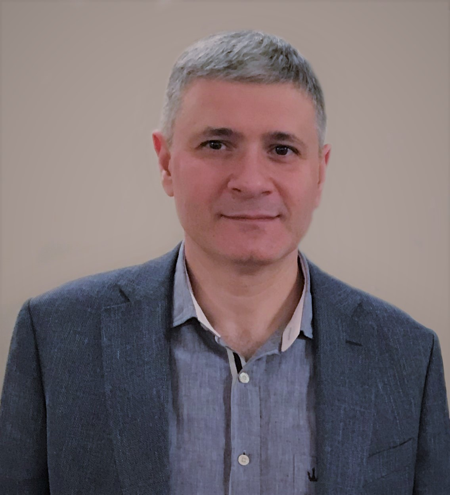

# Привет. Меня зовут Владимир

## Я учусь на инженера по тестированию программного обеспечения

### Вот, что я умею:

1. Ручное тестирование веб-приложений
   
***   
### Сертификаты Нетологии:

1. [Ручное тестирование веб-приложений](certificate.pdf)

